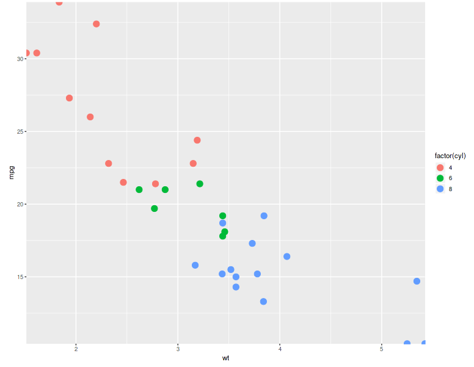
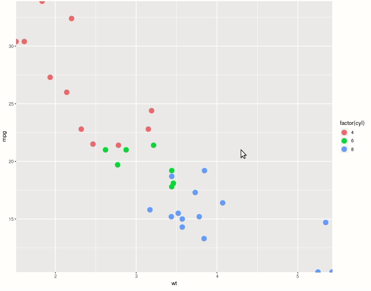
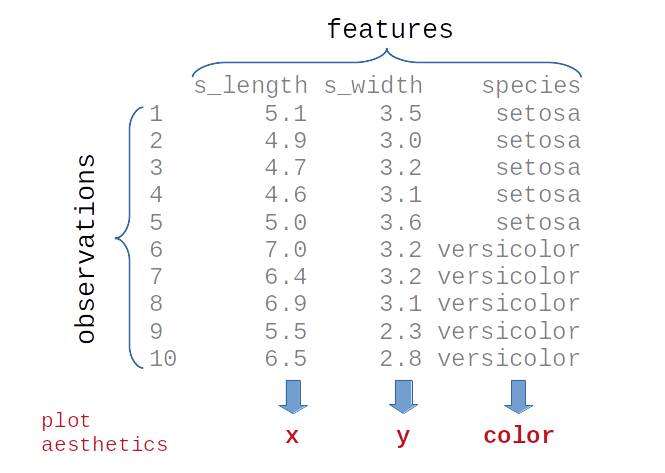
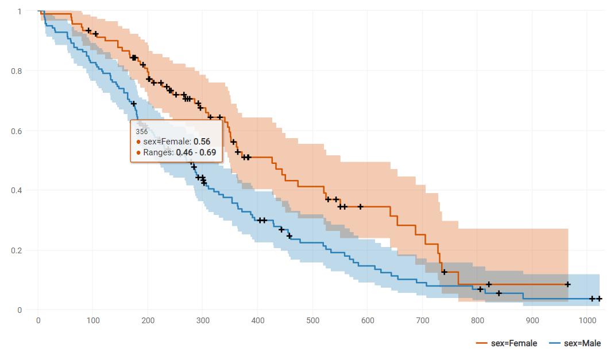
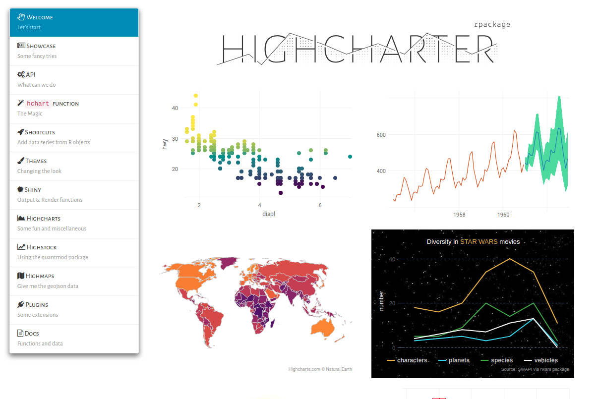
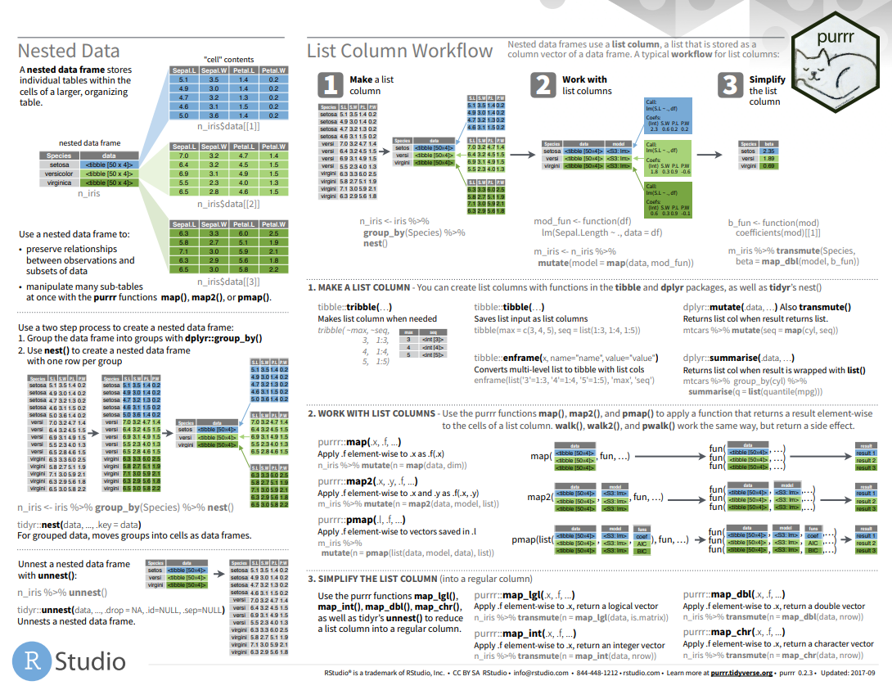
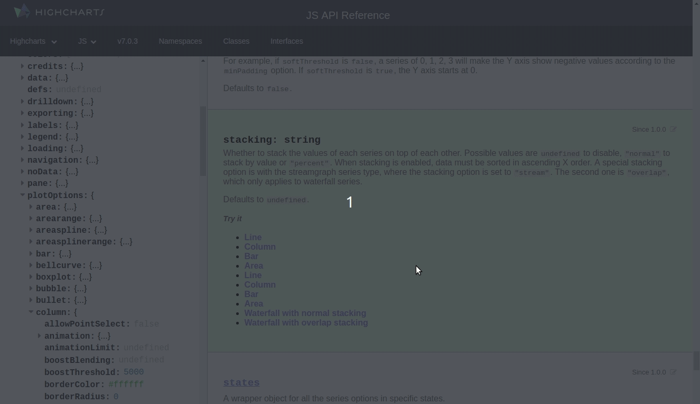

name: title

```{r include=FALSE}
library(forcats)
library(tidyr)
library(stringr)
library(glue)
```


name: title
class: title-slide
background-image: url(pics/templ_title.png)
background-position: 50% 100%
background-size: 100% 35%

<style>
.remark-slide-number {
  margin-left: -60px !important;
  margin-right: auto !important;
}
</style>

<hr style="margin: 150px 0px 0px 0px;">

# Bringing Interactivity to Classic Clinical Plots with <span style='color:#5f976c'>Highcharts</span> and <span style='color:#1f65cc'>R</span>

## Iaroslav Domin      


---
background-image: url(https://upload.wikimedia.org/wikipedia/commons/thumb/f/f5/Hoffmann-La_Roche_logo.svg/1920px-Hoffmann-La_Roche_logo.svg.png)
background-size: 65px
background-position: 98% 3%
name: layout
layout: true


---
name: agenda
exclude: false

# Agenda

<div style='font-size:28px; line-height: 50px;'>
1. Interactive visualization in R: options
2. Highcharts principles
3. Clinical graphs with Highcharts
4. Helpful resources
<div/>

---
name: gg-shiny
exclude: false

# static plot + shiny


  




  
<div style="position: absolute; top:470px; left: 110px; font-size: 200%; line-height: 60px;">
&#x2611; convenient
<br/>
&#9746; limited
</div>

---

name: fortunately
exclude: false

# Interfaces


  

  
<span style="position: absolute; top:500px; left: 110px; font-size: 450%;">
...
</span>
  


---
name: alter
exclude: false
name: plotly + bokeh

# Popular libraries ported to R

.pull-left[


```{r eval=FALSE}
library(plotly)
```

* JavaScript
* free (paid support)
* official R package 
* can translate ggplot2 to plotly 
]

.pull-right[


```{r eval=FALSE}
library(rbokeh)
```

* Python
* open-source
* fast
* not so fancy
]

???

[others](http://www.rebeccabarter.com/blog/2017-04-20-interactive/)

---
name: hc-intro
exclude: false
# Highcharts

.pull-left[

]

.pull-right[
```{r eval=FALSE}
library(highcharter)
```

<div style='line-height: 40px;'>
* <span style='color:#3d94d1; font-size:28px;'>**looks awesome!**</span>
* <span style='color:#d62d20; font-size:28px;'>**not free**</span>
* <span style='font-size:22px;'>javascript</span>
* <span style='font-size:22px;'>very different from ggplot2</span>
]
</div>

---
name: gg-philosophy-1
exclude: false

# ggplot2 philosophy



---
name: gg-philosophy-2
exclude: false

# ggplot2 philosophy

```{r message=FALSE, include=FALSE}
library(dplyr)
library(ggplot2)
df <- iris %>% 
  select(s_length = Sepal.Length, s_width = Sepal.Width, species = Species)
```

```{r include=FALSE}
knitr::opts_chunk$set(out.extra = 'style="position: absolute; bottom: 3%;"')
```

```{r fig.height=5.5}
ggplot(df, aes(x = s_length, y = s_width, color = species))
```

---
name: gg-philosophy-3
exclude: false

# ggplot2 philosophy


```{r fig.height=5.5}
ggplot(df, aes(x = s_length, y = s_width, color = species)) +
  geom_point()
```

---
name: gg-philosophy-4
exclude: false

# ggplot2 philosophy

```{r message=FALSE, fig.height=5.5}
ggplot(df, aes(x = s_length, y = s_width, color = species)) +
  geom_point() + 
  geom_smooth()
```

```{r include=FALSE}
knitr::opts_chunk$set(out.extra = NULL)
```

---
name: hc-philosophy
exclude: false

# Highcharts philosophy

### Dataframes?

### No, lists!

```{js}
series: [{
    name: 'SUBJ-01',
    data: [43934, 52503, 57177, 69658, 97031, 119931, 137133]
}, {
    name: 'SUBJ-02',
    data: [24916, 24064, 29742, 29851, 32490, 30282, 38121]
}, {
    name: 'SUBJ-03',
    data: [11744, 17722, 16005, 19771, 20185, 24377, 32147]
}, {
    name: 'SUBJ-04',
    data: [null, null, 7988, 12169, 15112, 22452, 34400]
}],
...
```

???
historically - HC initially built for timeseries data
nested lists is very natural thing for js as far as i can judge (at least more than for R)

---
name: simple
exclude: false

# Simple Example
```{r include=FALSE}
library(highcharter)
```

.pull-left[
```{r eval=FALSE}
highchart(
  list(
    series = list(
      list(name = "A",          #<<
           data = c(2, 3, 1)),  #<<
      list(name = "B",
           data = c(5, 0, 2))
      )
  )
)
```
]

.pull-right[
```{r echo=FALSE}
highchart(
  list(
    series = list(
      list(name = "A",
           data = c(2, 3, 1)),
      list(name = "B",
           data = c(5, 0, 2))
      )
  )
) %>% 
  hc_size(height = 400)
```
]

???
* 1-class citizen - series defined as lists
* must contain data attribute and others
* want to display multiple series - create list of list defining series
* list containing all the series - is actually one of the attributes in the list of plot options

* looks minimalistic and stylish
* but already provides you with some options such as tooltips, click on label element to hide corresponding records
* menu where you can save this plot

---
name: more-lists-1
exclude: false

# We need to go deeper

```{r more-lists, eval=FALSE}
highchart(
    list(
      series = list(
        list(name = "A",
          data = list(
            2,
            list(y = 3, #<<
                 marker = list(radius = 20), #<<
                 color = "red", #<<
                 name = "RED POINT"), #<<
            1)),
        list(name = "B",
           data = c(5, 0, 2))
        )
    )
)
```

???
(?) alter label option + add something interactive
further I will show a more impressive example of what can be done with individual point options
we
---
name: more-lists-2
exclude: false

# We need to go deeper
```{r ref.label="more-lists", echo=FALSE}
```
???
the idea is that you can pick arbitrary part of the plot
and set whatever options you want

---
name: hc-helpers-1
exclude: false

# It's not that bad actually

```{r not-that-bad, eval=FALSE}
highchart() %>%
  hc_add_series(data = c(2, 3, 1), name = "A") %>% 
  hc_add_series(data = c(5, 0, 2), name = "B") %>% 
  hc_chart(type = "column") %>%
  hc_title(text = "Super Meaningful Chart")
```

---
name: hc-helpers-2
exclude: false

# It's not that bad actually

```{r eval=FALSE}
highchart() %>% #<<
  hc_add_series(data = c(2, 3, 1), name = "A") %>% 
  hc_add_series(data = c(5, 0, 2), name = "B") %>% 
  hc_chart(type = "column") %>%
  hc_title(text = "Super Meaningful Chart")
```

---
name: hc-helpers-3
exclude: false

# It's not that bad actually

```{r eval=FALSE}
highchart() %>%
  hc_add_series(data = c(2, 3, 1), name = "A") %>% #<<
  hc_add_series(data = c(5, 0, 2), name = "B") %>% #<<
  hc_chart(type = "column") %>%
  hc_title(text = "Super Meaningful Chart")
```

---
name: hc-helpers-4
exclude: false

# It's not that bad actually

```{r eval=FALSE}
highchart() %>%
  hc_add_series(data = c(2, 3, 1), name = "A") %>% 
  hc_add_series(data = c(5, 0, 2), name = "B") %>% 
  hc_chart(type = "column") %>% #<<
  hc_title(text = "Super Meaningful Chart")
```

---
name: hc-helpers-5
exclude: false

# It's not that bad actually

```{r eval=FALSE}
highchart() %>%
  hc_add_series(data = c(2, 3, 1), name = "A") %>% 
  hc_add_series(data = c(5, 0, 2), name = "B") %>% 
  hc_chart(type = "column") %>%
  hc_title(text = "Super Meaningful Chart") #<<
```


---
name: hc-helpers-6
exclude: false

# It's not that bad actually
```{r ref.label="not-that-bad", eval=FALSE}
```

```{r echo=FALSE, fig.align='center'}
highchart() %>%
  hc_add_series(data = c(2, 3, 1), name = "A") %>% 
  hc_add_series(data = c(5, 0, 2), name = "B") %>% 
  hc_chart(type = "column") %>%
  hc_title(text = "Super Meaningful Chart") %>% 
  hc_size(height = 350, width = 500)
```

???
the author couldnt have just left us with these scary lists.
Added some helper functions. Would’ve been too cruel
what's cool in letting people write js-like in R?

---
name: hchart-gg
exclude: false

# Hey, I can do some ggplot2!

```{r include=FALSE}
library(dplyr)
library(highcharter)

rand_walk <- function(n, mean = 0, sd = 1) {
    cumsum(rnorm(n, mean, sd))
}

df_a <- data_frame(
    arm = "A",
    x = 1:100,
    y = rand_walk(100)
)

df_b <- data_frame(
    arm = "B",
    x = 1:100,
    y = rand_walk(100)
)

df <- bind_rows(df_a, df_b)
```

```{r eval=FALSE, include=TRUE}
hchart(df, "line", hcaes(x = x, y = y, group = arm))
```

```{r echo=FALSE, eval=TRUE}
hchart(df, "line", hcaes(x = x, y = y, group = arm)) %>% 
  hc_size(height = 450)
```

???
but to be honest it is quite limited
due to huge difference in philosophies

---
name: surv-1
exclude: false

# Survival

```{r survival, eval=TRUE}
library(survival)
library(dplyr)

lung <- survival::lung
lung <- mutate(lung, sex = ifelse(sex == 1, "Male", "Female"))
fit <- survfit(Surv(time, status) ~ sex, data = lung) 
fit
```

---
name: surv-2
exclude: false

# Survival

```{r echo=TRUE, eval=FALSE}
hchart(fit, ranges = TRUE)
```



---
name: spider-gg
exclude: false

# Spiderplot (ggplot2)

```{r echo=FALSE, message=FALSE, warning=FALSE, fig.width=11, dev='CairoPNG'}
library(readr)
library(ggplot2)

sp_df <- read_csv("data/sp_df.csv")

plot_type <- "usual"

p_size <- c(usual = 1.1, faceted = .7)[[plot_type]]*3
l_size <- c(usual = 1,   faceted = .7)[[plot_type]]*1.3
PCHG_range = c(-100, 110)
WEEK_range <- c(0, 56)


sp_df %>% 
    filter(CLASS == "SUMTGLES") %>% 
    ggplot(aes(WEEK, PCHG, group = USUBJID, color = BOR)) +
    scale_color_manual(
        "Confirmed BOR\n(Per Protocol)",
        values = c("CR" = "#00aedb", "PR" = "#00b159",
                   "SD" = "#ffc425", "PD" = "#d11141",
                   "NE" = "#545454"),
        guide  = guide_legend(order = 1)
    ) +
    theme_light() +
    # -30 to 20 region for PCHG
    annotate("rect", xmin = 0, xmax = WEEK_range[[2]], ymin = -30, ymax = 20, alpha = .15) +
    geom_hline(yintercept = 0, color = "gray75") +
    geom_point(size = p_size, data = function(data){filter(data, CLASS == "SUMTGLES")}) +
    geom_line(size = l_size, alpha = .7) +
    #geom_line(data = filter(df, LINETYPE == "d"), aes(linetype = LINETYPE), size = l_size, alpha = .4) +
    
    scale_y_continuous(limits = PCHG_range,
                       expand = c(0, 0),
                       breaks = c(-100, -50, -30, 0, 20, 50, 100),
                       minor_breaks = c(-30, 0, 20)) +
    
    scale_shape_manual(
        element_blank(),
        values = c("New Lesion" = 4, "Non-Trgt PD" = 1, "Trt Ongoing" = 62, "Loss of Exp." = 124),
        guide  = guide_legend(order = 2, override.aes = list(size = 3))
    ) +
    theme(legend.justification = "top",
          text = element_text(size = 15)) +
    labs(y = "change in target lesions [%]",
         x = "week") +
    theme(panel.grid = element_blank()) +
    scale_x_continuous(limits = WEEK_range,
                       breaks = round(seq(min(WEEK_range), max(WEEK_range), by = 4)),
                       expand = c(0, 0))
```


---
name: spider-hc
exclude: false

# Spiderplot (Highcharts)

```{r echo=FALSE, message=FALSE}

library(readr)
library(purrr)
library(dplyr)
library(highcharter)
sp_df <- read_csv("data/sp_df.csv")
source("hc.R")
hc_spi(sp_df)
```

???
(!) fix lower y limit to -100
zoomable - emphasize

---
name: waterfall
exclude: false

# Waterfall Plot

```{r echo=FALSE}
hc_wat(sp_df)
```

---
name: highcharter-lp
exclude: false

# Help: jkunst.com/highcharter




---
name: help-purrr
exclude: false

# Help: purrr package



---
name: help-doc
exclude: false


# Help: documentation + jsfiddle/codepen



???
some javascript knowledge will help but it isn't necessary

---
name: summary
exclude: false


# Summary

<div style='font-size:28px; line-height: 50px;'>
* probably the best looking
* not free for production use
* different from ggplot2


Find the slides at: [idmn.me](https://idmn.me)

---
name: questions


---
name: doing

<h1><span style='color:#3d94d1; position: fixed; top: 40%; left: 15%'>Doing now what patients need next </span></h1>
