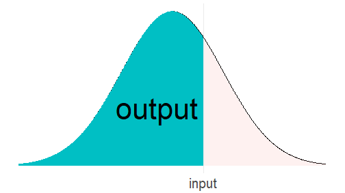
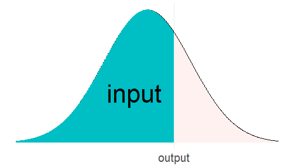
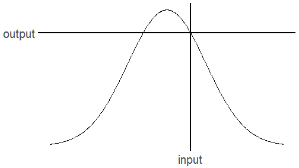

Probability Distributions
========================================================
author: Iaroslav Domin
date: 
autosize: false
width: 1300
height: 700

<style>
.medium-code pre code {
  font-size: 1.2em;
}
</style>


Probability
========================================================
left: 60%
class: medium-code



***

<font style="color:#4488CC;font-size:140%;margin-top:+45px;font-wight:bold">
pnorm
</font>


```r
pnorm(c(-3, 0, 3))
```

```
[1] 0.001349898 0.500000000 0.998650102
```


Quantile
========================================================
left: 60%
class: medium-code



***
<font style="color:#4488CC;font-size:140%;margin-top:+45px;font-wight:bold">
qnorm
</font>


```r
qnorm(c(0, 0.5, 0.95))
```

```
[1]     -Inf 0.000000 1.644854
```


Density
========================================================
left: 60%
class: medium-code



***
<font style="color:#4488CC;font-size:140%;margin-top:+45px;font-wight:bold">
dnorm
</font>


```r
dnorm(c(-3, 0, 3))
```

```
[1] 0.004431848 0.398942280 0.004431848
```

Sample
========================================================
left: 30%
class: medium-code

<div style="color:#4488CC;font-size:140%;margin-top:+45px">
rnorm
</div>

***


```r
rnorm(10)
```

```
 [1]  0.141472995 -0.202320113 -1.143421701  1.182617552  2.400351033
 [6]  1.539436815 -0.003827823 -0.288742347 -1.170578468 -0.872765451
```


Distribution Parameters
========================================================
class:medium-code


```r
rnorm(5, mean = 100, sd = 0.1) # 0, 1 by default
```

```
[1]  99.97684  99.97751  99.94500  99.98873 100.00527
```


```r
dnorm(1:3, mean = 5)
```

```
[1] 0.0001338302 0.0044318484 0.0539909665
```


```r
pnorm(c(-3, 3), sd = 100)
```

```
[1] 0.4880335 0.5119665
```


More Distributions
========================================================
class:medium-code
left: 30%


<font style="color:#4488CC;font-size:160%;margin-top:+45px;font-wight:bold">
p <br/><br/>
q <br/>
&nbsp;&nbsp;&nbsp;&nbsp;&nbsp;&nbsp;&nbsp;&nbsp;&nbsp;&nbsp;→ 
<br/>
d <br/><br/>
r
</font>

***

<font style="color:#4488CC;font-size:160%;margin-top:+45px;font-wight:bold">
t <br/><br/>
pois <br/><br/>
f <br/><br/>
gamma <br/><br/>

</font>

...

see `?Distributions`
