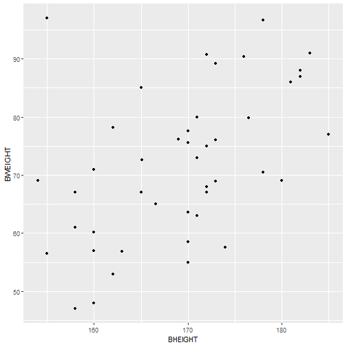
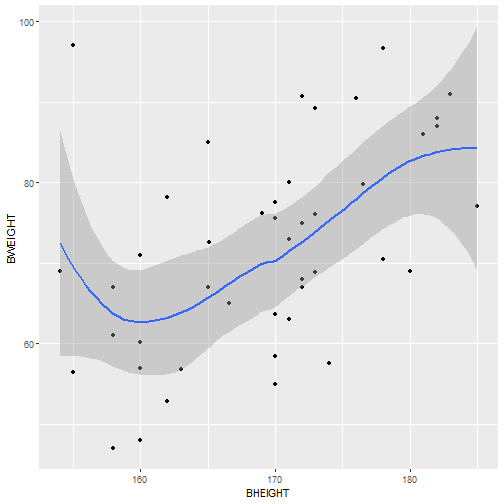
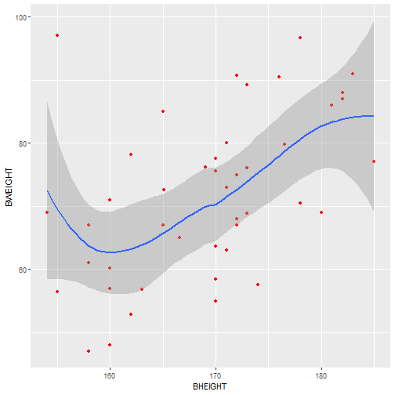
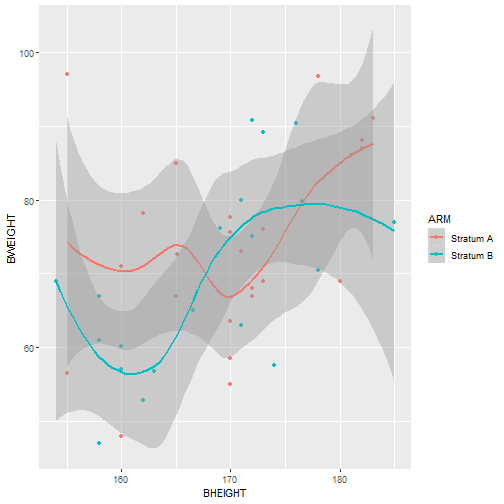
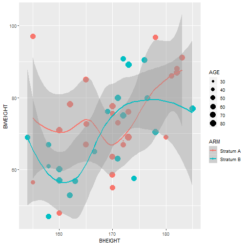
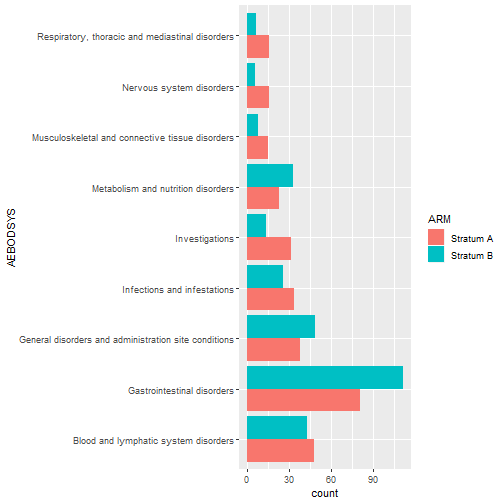
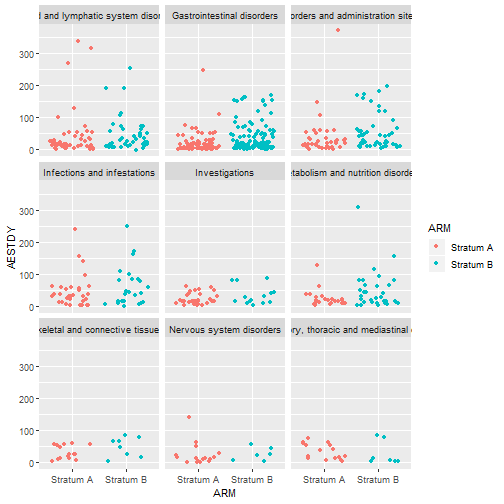
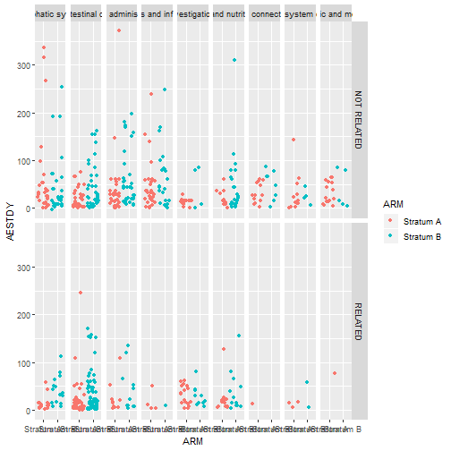
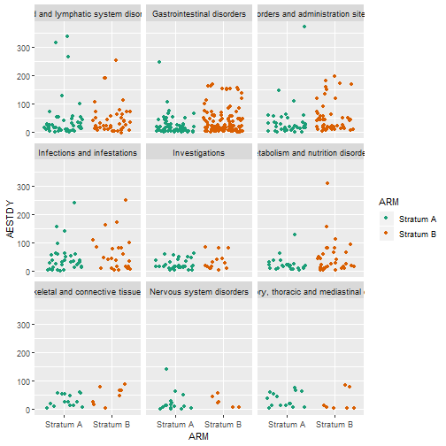
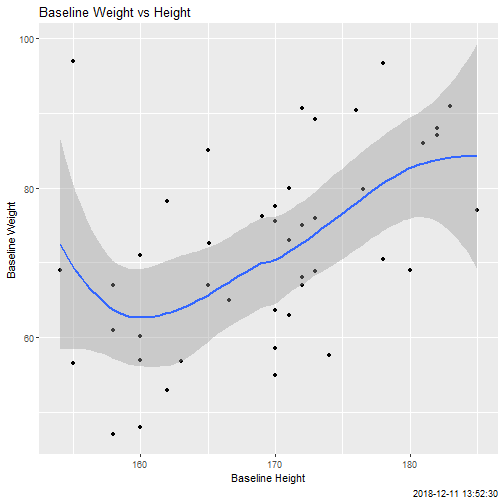

ggplot2
========================================================
author: Iaroslav Domin
date: 
autosize: false
width: 1300
height: 700

<style>
    .medium-code pre code {
      font-size: 1.2em;
    }
</style>


Plots in R
========================================================

What we are not going to discuss: 
* base R functions
* grid package (though ggplot2 is built on top of grid)
* D3, plotly

Quick Start
========================================================
class: medium-code
left: 40%


<div style="color:#4488CC;font-size:120%;margin-top:+120px">
ggplot(data, aes(x, y))
<br/>
&nbsp;&nbsp;&nbsp;&nbsp;+ geom_...()
</div>

***


```r
ggplot(adsl, aes(BHEIGHT, BWEIGHT)) + geom_point()
```


Add more layers
========================================================
class: medium-code
left: 50%

<pre>
<div style="font-size:124%;margin-top:+20px">
ggplot(adsl, aes(BHEIGHT, BWEIGHT)) +
    geom_point() +
    <font style="color:#4488CC;font-weight:bold">geom_smooth()</font>

</div>
</pre>

***



Change Colors
========================================================
class: medium-code
left: 50%

<pre>
<div style="font-size:124%;margin-top:+20px">
ggplot(adsl, aes(BHEIGHT, BWEIGHT)) +
    geom_point(<font style="color:#4488CC;font-weight:bold">color = "red"</font>) +
    geom_smooth()

</div>
</pre>

***



You can map a variable to color
========================================================
class: medium-code
left: 50%

<pre>
<div style="font-size:124%;margin-top:+20px">
ggplot(adsl, aes(BHEIGHT, BWEIGHT, <font style="color:#4488CC;font-weight:bold">color = ARM</font>)) +
    geom_point() +
    geom_smooth()

</div>
</pre>

***




... and even to size
========================================================
class: medium-code
left: 50%

<pre>
<div style="font-size:124%;margin-top:+20px">
ggplot(adsl, aes(BHEIGHT, BWEIGHT, color = ARM)) +
    geom_point(<font style="color:#4488CC;font-weight:bold">aes(size = AGE)</font>) +
    geom_smooth()

</div>
</pre>

***



More to check
========================================================

<h3>Geoms</h3>

<font style="color:#4488CC;">
geom_boxplot

geom_bar

geom_histogram

geom_text
</font>

... 

type "geom_" and explore

***

<h3>Aestetics</h3>

<font style="color:#4488CC;">
linetype

fill

alpha

shape
</font>

...

note: not all aes may be available for each particular geom, check geoms documentation


Note
========================================================
class: medium-code

A plot is an object. You can name it and use it later on.


```r
p <- ggplot(adsl, aes(BHEIGHT, BWEIGHT)) +
    geom_point()
class(p)
```

```
[1] "gg"     "ggplot"
```

```r
p + geom_smooth()
```


Exercise 1
========================================================

```r
adsl <- read_sas("data/adsl.sas7bdat")
```

1. Display how patients within each arm start treatment over time. You would need variables TRTSDT and ARM, use geom_point. 

2. Color points by arm.

3. Make point shape dependent on patient's sex.

4. Probably point size will be too small, this can be fixed by size parameter in geom_point.

5. Lots of points are actuially plotted on top of one another. Use geom_jitter insted of geom_point.


Exercise 2
========================================================


```r
adae1 <- read_sas("data/adae.sas7bdat") %>% 
    group_by(AEBODSYS) %>% 
    filter(n() >= 20) %>% 
    ungroup
```


1. Use geom_bar to show counts for each AEBODSYS.

2. Add coord_flip()

3. Color by ARM (aesetic fill)

4. Use position = "dodge" for the geom.


Factors
========================================================
class: medium-code
left: 35%

<div style="color:#4488CC;font-size:120%;margin-top:+20px">
factor(...)
<br/><br/><br/><br/>
factor(..., levels = ...)
</div>


***


```r
s <- c("F", "F", "M", "F", "M", "M", "F")
factor(s)
```

```
[1] F F M F M M F
Levels: F M
```

```r
factor(s, levels = c("M", "F"))
```

```
[1] F F M F M M F
Levels: M F
```


Factors
========================================================
class: medium-code
left: 35%

<div style="color:#4488CC;font-size:120%;margin-top:+20px">
levels(...)
<br/><br/><br/><br/>
levels(...) <-
</div>

***


```r
f <- factor(s)
levels(f)
```

```
[1] "F" "M"
```

```r
levels(f) <- c("Female", "Male")
f
```

```
[1] Female Female Male   Female Male   Male   Female
Levels: Female Male
```

Levels define the order in which groups are displayed in the plot.

forcats package
========================================================
class: medium-code
left: 35%

<div style="color:#4488CC;font-size:120%;margin-top:+45px">
fct_infreq
</div>

<div style="color:#4488CC;font-size:120%;margin-top:+130px">
fct_rev
</div>

<div style="color:#4488CC;font-size:120%;margin-top:+140px">
fct_inorder <br/>
fct_reorder <br/>
fct_c       <br/>
...
</div>

***

```r
library(forcats)
ARM <- c("A", "B", "C", "B", "B", "A")
fct_infreq(ARM)
```

```
[1] A B C B B A
Levels: B A C
```

```r
fct_rev(ARM)
```

```
[1] A B C B B A
Levels: C B A
```

Exercise 3
========================================================
class: medium-code


```r
adae1 %>% 
    ggplot(aes(AEBODSYS, fill = ARM)) +
    geom_bar(position = "dodge") +
    coord_flip() 
```



***

1. By default factor levels are ordered alphabetically, but since the coordinate origin is in bottom-left corner, it makes it go from bottom to top. Make groups go alpahbetically from top to bottom.

2. Order groups by frequency.


facet_wrap
========================================================
class: medium-code
left: 50%

<pre>
<div style="font-size:124%;margin-top:+20px">
ggplot(adae1, aes(ARM, AESTDY, color = ARM)) +
    geom_jitter() +
    <font style="color:#4488CC;font-weight:bold">facet_wrap(~AEBODSYS)</font>
</div>
</pre>

***




facet_grid
========================================================
class: medium-code
left: 45%

<pre>
<div style="font-size:124%;margin-top:+20px">
ggplot(adae1, aes(ARM, AESTDY, color = ARM)) +
    geom_jitter() +
    <font style="color:#4488CC;font-weight:bold">facet_grid(AEREL~AEBODSYS)</font>
</div>
</pre>

***



Exercise 4
========================================================
Create a graph as described above, but with boxplots instead of jittered points and . (dot) instead of AEREL in facet_grid.

Modify color palettes, axis breaks etc
========================================================
class: medium-code

Just Google it :)


```r
ggplot(adae1, aes(ARM, AESTDY, color = ARM)) +
    geom_jitter() +
    facet_wrap(~AEBODSYS) + 
    scale_color_brewer(palette = "Dark2")
```




Labels, Titles, Footnotes
========================================================
class: medium-code
left: 40%

<pre>
<div style="font-size:124%;margin-top:+20px">
p <- ggplot(adsl, aes(BHEIGHT, BWEIGHT)) +
    geom_point() +
    geom_smooth()
    
p +
<font style="color:#4488CC;font-weight:bold">xlab("Baseline Height") +
    ylab("Baseline Weight") +
    ggtitle("Baseline Weight vs Height") +
    labs(caption = Sys.time())
    </font>
</div>
</pre>

***


Themes
========================================================
class: medium-code
left: 40%
<font style="color:#4488CC;font-weight:bold">
theme_...
</font>

and check out ggthemes package

<pre>
<div style="font-size:124%;margin-top:+20px">
p + <font style="color:#4488CC;font-weight:bold">ggthemes::theme_base()</font>
</div>
</pre>

***


```
Error in loadNamespace(name) : there is no package called 'ggthemes'
```
